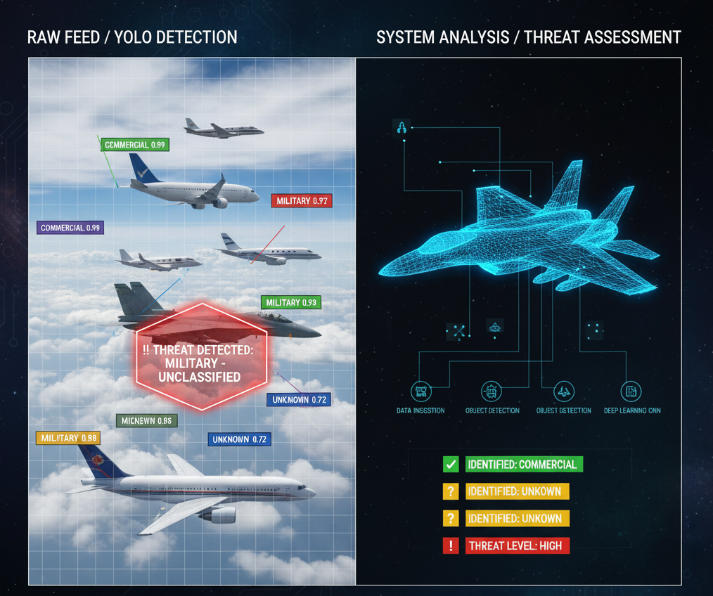

# Aircraft Threat Detection Using Computer Vision



## Overview

This project focuses on detecting and classifying potential aircraft threats in images and video streams using computer vision. The goal is to identify aircraft, determine their type, and assess whether they represent a potential threat based on visual features and context.

The workflow begins with image preprocessing techniques such as resizing, noise reduction, and edge enhancement to prepare the data for analysis. Following preprocessing, the system applies object detection and classification models such as YOLO (You Only Look Once) to localize aircraft in each frame and classify them by type and potential threat level. Transfer learning models like ResNet or MobileNet may also be used to improve classification accuracy on specific datasets. The model filters low-confidence detections and labels each aircraft with its predicted category (e.g., civilian, military, or unknown).

This project demonstrates the use of image processing, deep learning, and real-time object detection for practical applications in aerospace monitoring, defense research, and early-warning systems.

## Datasets

This project utilizes the following public datasets for training and evaluation:

- **[Matthew Giarra Aircraft Datasets](https://github.com/matthewgiarra/aircraft-datasets)** - Diverse aircraft imagery collection
- **[MilAir Dataset](https://www.kaggle.com/datasets/a2015003713/militaryaircraftdetectiondataset)** - Military aircraft detection dataset
- **[HRPlanesv2](https://www.kaggle.com/datasets/mhz8989/hrplanesv2dataset)** - High-resolution planes dataset
- **[AircraftDetection-YOLOv5](https://www.kaggle.com/datasets/khlaifiabilel/aircraftdetection)** - Aircraft detection with YOLOv5
- **[CNN-to-Classify-Military-Aircraft](https://www.kaggle.com/datasets/a2015003713/militaryaircraftdetectiondataset)** - CNN classification dataset

These datasets provide a diverse range of labeled aircraft imagery, including both commercial and military models.

## Methods Applied

### Preprocessing
- **Resizing**: Standardizing image dimensions for model input
- **Normalization**: Scaling pixel values for improved training
- **Noise Reduction**: Removing unwanted artifacts and enhancing image quality
- **Edge Detection**: Highlighting aircraft contours and features

### Object Detection
- **YOLO (You Only Look Once)**: Real-time aircraft identification and localization
- Single-stage detector for efficient processing of video streams

### Classification
- **CNNs**: Convolutional Neural Networks for feature extraction
- **ResNet**: Deep residual networks for improved accuracy
- **MobileNet**: Lightweight architecture for efficient inference
- **Transfer Learning**: Leveraging pre-trained models for better performance

### Post-processing
- Filtering low-confidence detections
- Labeling aircraft as commercial, military, or unknown
- Threat level assessment based on classification results

## Project Structure

```
Aircraft-Threat-Detection-Using-Computer-Vision/
│
├── data/                           # Dataset storage
│   ├── dataset/                   # Military aircraft images and annotations
│   ├── fgvc-aircraft-2013b/       # FGVC aircraft dataset
│   ├── processed/                 # Preprocessed data
│   │   ├── yolo_format/          # YOLO format annotations
│   │   └── classification/        # Classification ready data
│   └── raw/                       # Raw data backup
│
├── notebooks/                      # Jupyter notebooks
│   ├── 01_data_exploration.ipynb  # Dataset exploration and analysis
│   └── 02_preprocessing.ipynb     # Data preprocessing pipeline
│
├── src/                           # Source code modules
│   ├── preprocessing/             # Preprocessing utilities
│   ├── detection/                 # Object detection modules
│   ├── classification/            # Classification models
│   └── utils/                     # Helper functions
│
├── models/                        # Trained model storage
│   ├── yolo/                      # YOLO model checkpoints
│   └── classification/            # Classification model checkpoints
│
├── results/                       # Output results
│   ├── visualizations/            # Result visualizations
│   └── models_output/             # Model predictions
│
├── logs/                          # Training logs
│
├── requirements.txt               # Python dependencies
├── README.md                      # Project documentation
├── DATASET_INFO.md               # Dataset reference guide
├── LICENSE                        # MIT License
└── .gitignore                    # Git ignore rules
```

## Getting Started

### Prerequisites

- Python 3.8 or higher
- CUDA-capable GPU (recommended for training)

### Installation

1. Clone the repository:
```bash
git clone https://github.com/yourusername/Aircraft-Threat-Detection-Using-Computer-Vision.git
cd Aircraft-Threat-Detection-Using-Computer-Vision
```

2. Create a virtual environment:
```bash
python -m venv venv
source venv/bin/activate  # On Windows: venv\Scripts\activate
```

3. Install dependencies:
```bash
pip install -r requirements.txt
```

### Usage

1. Open and explore the Jupyter notebook:
```bash
jupyter notebook notebooks/01_data_exploration.ipynb
```

2. Follow the notebook to get started with data exploration and preprocessing.

Detailed usage instructions will be added as the project develops.

## Applications

This aircraft threat detection system can support:
- **Aerospace Monitoring**: Real-time surveillance of airspace
- **Defense Research**: Analysis of military aircraft movements
- **Early-Warning Systems**: Automated threat detection and alerting
- **Security Operations**: Perimeter and restricted airspace monitoring


## Course Information

Final Project for CS 521 - Computer Vision

## License

This project is licensed under the MIT License - see the [LICENSE](LICENSE) file for details.

## Acknowledgments

- Datasets provided by the computer vision and aerospace research communities
- YOLO implementation and techniques demonstrated in CS 521
- Open-source computer vision libraries: OpenCV, PyTorch, TensorFlow
