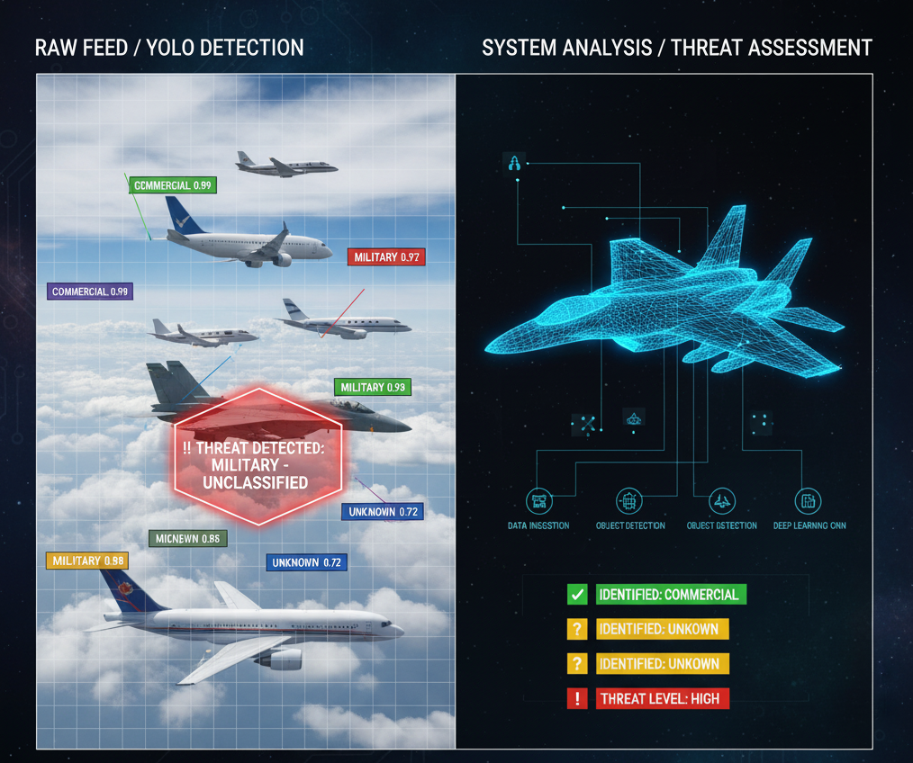

# Aircraft Threat Detection Using Computer Vision



## Overview

This project focuses on detecting and classifying potential aircraft threats in images and video streams using computer vision. The goal is to identify aircraft, determine their type, and assess whether they represent a potential threat based on visual features and context.

The workflow begins with image preprocessing techniques such as resizing, noise reduction, and edge enhancement to prepare the data for analysis. Following preprocessing, the system applies YOLOv8 object detection models to localize aircraft in each frame and classify them by type and potential threat level. The model filters low-confidence detections and labels each aircraft with its predicted category (e.g., civilian, military, or unknown).

This project demonstrates the use of image processing, deep learning, and real-time object detection for practical applications in aerospace monitoring, defense research, and early-warning systems.

## Key Features

- ✅ **Real-time Detection**: Webcam-based aircraft detection using Gradio web interface
- ✅ **Two Model Variants**: YOLOv8n (Nano) and YOLOv8s (Small) trained and evaluated
- ✅ **Data Augmentation**: On-the-fly augmentation techniques for improved generalization
- ✅ **Comprehensive Evaluation**: Test set performance metrics and visualizations
- ✅ **Threat Classification**: Automatic labeling of detected aircraft as THREAT or SAFE
- ✅ **Deployment Ready**: Gradio application for real-time inference

## Datasets

This project utilizes the following public datasets for training and evaluation:

- **[Matthew Giarra Aircraft Datasets](https://github.com/matthewgiarra/aircraft-datasets)** - Diverse aircraft imagery collection
- **[MilAir Dataset](https://www.kaggle.com/datasets/a2015003713/militaryaircraftdetectiondataset)** - Military aircraft detection dataset
- **[HRPlanesv2](https://www.kaggle.com/datasets/mhz8989/hrplanesv2dataset)** - High-resolution planes dataset
- **[AircraftDetection-YOLOv5](https://www.kaggle.com/datasets/khlaifiabilel/aircraftdetection)** - Aircraft detection with YOLOv5
- **[CNN-to-Classify-Military-Aircraft](https://www.kaggle.com/datasets/a2015003713/militaryaircraftdetectiondataset)** - CNN classification dataset

These datasets provide a diverse range of labeled aircraft imagery, including both commercial and military models.

**Final Processed Dataset:**
- **Total Images**: ~49,482 labeled images
- **Train Split**: ~34,520 images
- **Validation Split**: ~8,981 images
- **Test Split**: ~5,981 images
- **Classes**: Multiple aircraft categories (commercial and military)

## Models Trained

### Model 1: YOLOv8n (Nano)
**Purpose**: Fast, lightweight model for real-time inference

- **Baseline** (No Augmentation): Trained from scratch
- **Augmented** (On-the-Fly Augmentation): Enhanced with data augmentation

**Test Set Performance:**
- Baseline: mAP@0.5 = 0.377, Precision = 0.358, Recall = 0.390
- **Augmented**: mAP@0.5 = **0.531**, Precision = 0.471, Recall = 0.532

**Best Model Location**: `results/model_1_output/augmented_on_fly/weights/best.pt`

### Model 2: YOLOv8s (Small) ⭐ **BEST PERFORMER**
**Purpose**: Balanced model with improved accuracy

- **Baseline** (No Augmentation): Trained from scratch
- **Augmented** (On-the-Fly Augmentation): Enhanced with data augmentation

**Test Set Performance:**
- Baseline: mAP@0.5 = 0.451, Precision = 0.504, Recall = 0.384
- **Augmented**: mAP@0.5 = **0.671**, Precision = **0.649**, Recall = **0.636**

**Improvement over YOLOv8n**: +26.4% mAP@0.5 improvement

**Best Model Location**: `results/model_2_output/yolov8s_augmented/weights/best.pt`

## Methods Applied

### Preprocessing
- **Resizing**: Standardizing image dimensions to 640×640 for model input
- **Normalization**: Scaling pixel values for improved training
- **Noise Reduction**: Removing unwanted artifacts and enhancing image quality
- **YOLO Format Conversion**: Converting annotations to YOLO format with proper train/val/test splits

### Object Detection
- **YOLOv8 (You Only Look Once)**: Real-time aircraft identification and localization
  - YOLOv8n (Nano): Fastest, smallest model
  - YOLOv8s (Small): Balanced performance and speed
- Single-stage detector for efficient processing of video streams

### Data Augmentation
- **On-the-Fly Augmentation** during training:
  - HSV augmentation (hue, saturation, value)
  - Translation and scaling
  - Horizontal flipping
  - Mosaic augmentation

### Post-processing
- Filtering low-confidence detections (confidence threshold: 0.25)
- Non-maximum suppression (IoU threshold: 0.45)
- Labeling aircraft as commercial, military, or unknown
- Threat level assessment based on classification results

## Project Structure

```
Aircraft-Threat-Detection-Using-Computer-Vision/
│
├── data/                           # Dataset storage
│   ├── dataset/                   # Military aircraft images and annotations
│   ├── fgvc-aircraft-2013b/       # FGVC aircraft dataset
│   ├── processed/                 # Preprocessed data
│   │   └── yolo_format/          # YOLO format annotations
│   │       ├── images/           # Train/val/test splits
│   │       ├── labels/           # YOLO format labels
│   │       ├── dataset.yaml      # Dataset configuration
│   │       └── classes.txt       # Aircraft class names
│   └── raw/                       # Raw data backup
│
├── notebooks/                      # Jupyter notebooks
│   ├── 01_data_exploration.ipynb  # Dataset exploration and analysis
│   ├── 02_preprocessing.ipynb     # Data preprocessing pipeline
│   ├── 03_model_1_training.ipynb  # YOLOv8n training & evaluation
│   ├── 03_model_2_training.ipynb  # YOLOv8s training & evaluation
│   └── Aircraft_Threat_Detection_Team_Project.ipynb
│
├── app/                           # Deployment application
│   ├── app.py                    # Gradio web application
│   ├── config.py                 # Configuration settings
│   ├── utils.py                  # Helper functions
│   └── README_DEPLOYMENT.md      # Deployment guide
│
├── results/                       # Training and evaluation results
│   ├── model_1_output/           # YOLOv8n results
│   │   ├── baseline_no_aug/      # Baseline model outputs
│   │   └── augmented_on_fly/     # Augmented model outputs
│   ├── model_1_test_evaluation/  # Test set evaluation (YOLOv8n)
│   ├── model_1_visualizations/   # Training curves and plots
│   ├── model_2_output/           # YOLOv8s results
│   │   ├── yolov8s_baseline*/    # Baseline model outputs
│   │   └── yolov8s_augmented/    # Augmented model outputs
│   ├── model_2_test_evaluation/  # Test set evaluation (YOLOv8s)
│   └── model_2_visualizations/   # Training curves and plots
│
├── models/                        # Trained model storage (optional)
│   ├── yolo/                     # YOLO model checkpoints
│   └── classification/           # Classification model checkpoints
│
├── logs/                          # Training logs
│
├── requirements.txt               # Python dependencies
├── README.md                      # Project documentation
├── LICENSE                        # MIT License
└── .gitignore                    # Git ignore rules
```

## Getting Started

### Prerequisites

- Python 3.8 or higher
- CUDA-capable GPU (recommended for training)
- Webcam (for real-time detection demo)

### Installation

1. **Clone the repository:**
```bash
git clone https://github.com/yourusername/Aircraft-Threat-Detection-Using-Computer-Vision.git
cd Aircraft-Threat-Detection-Using-Computer-Vision
```

2. **Create a virtual environment:**
```bash
python -m venv venv
source venv/bin/activate  # On Windows: venv\Scripts\activate
```

3. **Install dependencies:**
```bash
pip install -r requirements.txt
```

### Usage

#### 1. Data Exploration and Preprocessing

```bash
jupyter notebook notebooks/01_data_exploration.ipynb
jupyter notebook notebooks/02_preprocessing.ipynb
```

#### 2. Model Training

Each training notebook includes the complete workflow:
- Train baseline model (no augmentation)
- Train augmented model (on-the-fly augmentation)
- Plot training curves
- Evaluate on test set
- Generate performance comparisons and visualizations

**Train Model 1 (YOLOv8n):**
```bash
jupyter notebook notebooks/03_model_1_training.ipynb
```

**Train Model 2 (YOLOv8s):**
```bash
jupyter notebook notebooks/03_model_2_training.ipynb
```

#### 3. Real-Time Detection Application

Deploy the Gradio web application for real-time aircraft detection:

```bash
cd app
python app.py
```

Or use the provided script:
```bash
./app/run.sh
```

The application will start on `http://localhost:7860`

**Features:**
- Real-time webcam detection
- Image upload option
- Bounding box visualization
- Threat classification (THREAT/SAFE)
- Confidence scores

For detailed deployment instructions, see [app/README_DEPLOYMENT.md](app/README_DEPLOYMENT.md)

## Results Summary

### Model Comparison

| Model | Variant | mAP@0.5 | mAP@0.5:0.95 | Precision | Recall |
|-------|---------|---------|--------------|-----------|--------|
| YOLOv8n | Baseline | 0.377 | 0.358 | 0.358 | 0.390 |
| YOLOv8n | Augmented | 0.531 | 0.507 | 0.471 | 0.532 |
| YOLOv8s | Baseline | 0.451 | 0.431 | 0.504 | 0.384 |
| **YOLOv8s** | **Augmented** | **0.671** | **0.646** | **0.649** | **0.636** |

**Key Findings:**
- Data augmentation significantly improves model performance (+41% for YOLOv8n, +49% for YOLOv8s)
- YOLOv8s outperforms YOLOv8n by 26.4% in mAP@0.5
- Best model: YOLOv8s Augmented (used in deployment app)

## Applications

This aircraft threat detection system can support:

- **Aerospace Monitoring**: Real-time surveillance of airspace
- **Defense Research**: Analysis of military aircraft movements
- **Early-Warning Systems**: Automated threat detection and alerting
- **Security Operations**: Perimeter and restricted airspace monitoring
- **Educational Demonstrations**: Teaching computer vision and object detection

## Technical Details

### Training Configuration

- **Epochs**: 50
- **Batch Size**: 16
- **Image Size**: 640×640
- **Patience**: 10 (early stopping)
- **Optimizer**: SGD with momentum
- **Learning Rate**: Adaptive with cosine annealing

### Deployment Configuration

- **Confidence Threshold**: 0.25
- **IoU Threshold**: 0.45
- **Model**: YOLOv8s Augmented (best.pt)
- **Framework**: Gradio 6.x
- **Web Interface**: Real-time video streaming

## Course Information

Final Project for **CS 521 - Computer Vision**

## License

This project is licensed under the MIT License - see the [LICENSE](LICENSE) file for details.

## Acknowledgments

- Datasets provided by the computer vision and aerospace research communities
- YOLO implementation and techniques from Ultralytics
- Open-source computer vision libraries: OpenCV, PyTorch, Ultralytics YOLOv8
- Gradio for deployment framework

## Future Improvements

- [ ] Improve real-time video streaming performance
- [ ] Add multi-threading for better frame processing
- [ ] Support for video file input
- [ ] Model quantization for faster inference
- [ ] Export to ONNX/TensorRT for production deployment
- [ ] Add more sophisticated threat classification logic